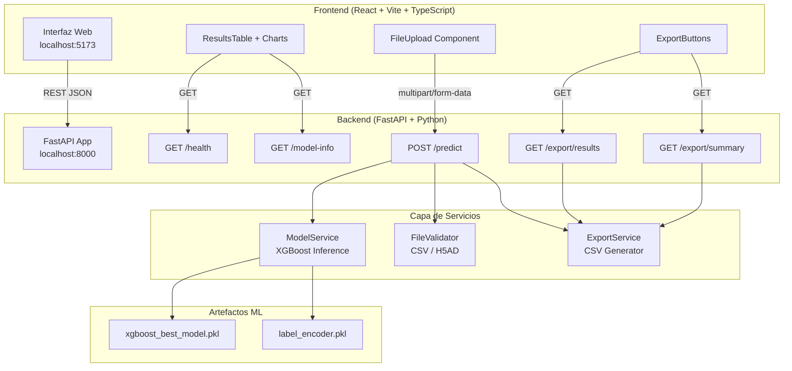

# Clasificador Automático de Tipos Celulares scRNA-seq

Plataforma web local para clasificación automática de tipos celulares a partir de datos de
secuenciación de ARN de célula única (scRNA-seq), construida sobre **FastAPI + React + XGBoost**.

---

## Arquitectura del sistema



---

## Estructura del proyecto

```
project/
├── backend/
│   ├── app/
│   │   ├── main.py               # Entrada FastAPI + lifespan
│   │   ├── routes/
│   │   │   ├── health.py         # GET /health, GET /model-info
│   │   │   └── predictions.py    # POST /predict, GET /export/*
│   │   ├── services/
│   │   │   ├── model_service.py  # Carga y ejecución XGBoost
│   │   │   └── export_service.py # Generación CSV
│   │   ├── schemas/
│   │   │   └── prediction.py     # Modelos Pydantic
│   │   └── utils/
│   │       └── file_validator.py # Validación CSV / H5AD
│   ├── models/                   # ← Coloca aquí tus .pkl
│   │   ├── xgboost_best_model.pkl
│   │   └── label_encoder.pkl
│   ├── scripts/
│   │   ├── generate_demo_model.py
│   │   └── generate_test_data.py
│   └── requirements.txt
├── frontend/
│   ├── src/
│   │   ├── App.tsx
│   │   ├── main.tsx
│   │   ├── index.css
│   │   ├── types/index.ts
│   │   ├── services/api.ts
│   │   ├── pages/HomePage.tsx
│   │   └── components/
│   │       ├── ModelStatusCard.tsx
│   │       ├── FileUpload.tsx
│   │       ├── ResultsTable.tsx
│   │       ├── Charts.tsx
│   │       ├── SummaryCards.tsx
│   │       ├── ExportButtons.tsx
│   │       ├── ErrorAlert.tsx
│   │       ├── LoadingSpinner.tsx
│   │       └── icons.tsx
│   ├── package.json
│   ├── vite.config.ts
│   └── tailwind.config.js
├── data/
│   └── processed/            # Datos de prueba generados
├── docs/
└── README.md
```

---

## Requisitos previos

| Herramienta | Versión mínima |
|------------|---------------|
| Python     | 3.10+         |
| Node.js    | 18+           |
| npm        | 9+            |

---

## Instalación y ejecución

### 1. Colocar artefactos del modelo

Copia tus archivos entrenados en:

```
backend/models/xgboost_best_model.pkl
backend/models/label_encoder.pkl
```

> Si no tienes los archivos reales, genera modelos demo:
> ```bash
> cd backend
> python scripts/generate_demo_model.py
> ```

### 2. Backend (FastAPI)

```bash
# Desde la raíz del proyecto
cd backend

# Crear entorno virtual
python -m venv venv

# Activar (Windows)
venv\Scripts\activate

# Activar (Linux/Mac)
source venv/bin/activate

# Instalar dependencias
pip install -r requirements.txt

# Iniciar servidor
uvicorn app.main:app --reload --host 0.0.0.0 --port 8000
```

El backend queda disponible en: **http://localhost:8000**
Documentación Swagger: **http://localhost:8000/docs**

### 3. Frontend (React + Vite)

```bash
# Desde la raíz del proyecto
cd frontend

# Instalar dependencias
npm install

# Iniciar servidor de desarrollo
npm run dev
```

El frontend queda disponible en: **http://localhost:5173**

### 4. Generar datos de prueba (opcional)

```bash
cd backend
python scripts/generate_test_data.py
```

Genera:
- `data/processed/test_data.csv` — 500 células con PC1…PC50
- `data/processed/test_data.h5ad` — 500 células con obsm['X_pca']

---

## Endpoints de la API

### GET /health

```json
{
  "status": "ok",
  "model_loaded": true,
  "version": "1.0.0"
}
```

### GET /model-info

```json
{
  "model": "XGBoost",
  "accuracy": 0.989,
  "f1_macro": 0.97,
  "classes": ["B", "T", "NK", "MNP", "pDC", "mast"],
  "n_features": 50,
  "status": "loaded",
  "description": "Clasificador XGBoost entrenado sobre 328.170 células..."
}
```

### POST /predict

**Request:** `multipart/form-data` con campo `file` (CSV o H5AD).

```bash
curl -X POST http://localhost:8000/predict \
  -F "file=@data/processed/test_data.csv"
```

**Response:**

```json
{
  "total_cells": 500,
  "predictions": [
    { "cell_id": "cell_00000", "predicted_class": "T", "confidence": 0.9812 },
    { "cell_id": "cell_00001", "predicted_class": "B", "confidence": 0.9445 }
  ],
  "summary": { "B": 148, "T": 201, "NK": 61, "MNP": 52, "pDC": 24, "mast": 14 },
  "summary_percentage": { "B": 29.6, "T": 40.2, "NK": 12.2, "MNP": 10.4, "pDC": 4.8, "mast": 2.8 },
  "processing_time_seconds": 0.0421,
  "input_format": "CSV"
}
```

### GET /export/results

Descarga `resultados.csv` con columnas: `cell_id, predicted_class, confidence`.

### GET /export/summary

Descarga `reporte_resumen.csv` con estadísticas por tipo celular.

---

## Formato de archivos de entrada

### CSV

El archivo debe contener columnas `PC1` a `PC50` (o las primeras 50 columnas numéricas).
Opcionalmente una columna `cell_id`.

```
cell_id,PC1,PC2,...,PC50
cell_0,0.123,-0.456,...,0.789
```

### H5AD (AnnData)

El objeto `AnnData` debe tener calculado el PCA en `adata.obsm['X_pca']`
con al menos 50 componentes.

```python
import scanpy as sc
adata = sc.read_h5ad("mi_dataset.h5ad")
# Requiere: adata.obsm['X_pca'].shape[1] >= 50
```

---

## Manejo de errores

| Código | Descripción |
|--------|-------------|
| 400 | Formato de archivo inválido |
| 413 | Archivo demasiado grande (>500 MB) |
| 422 | PCA no encontrado / Dimensiones incompatibles |
| 500 | No fue posible realizar la inferencia |

---

## Clases celulares

| Clase | Descripción |
|-------|-------------|
| B     | Células B (linfocitos B) |
| T     | Células T (linfocitos T) |
| NK    | Natural Killer cells |
| MNP   | Mononuclear Phagocytes |
| pDC   | Plasmacytoid Dendritic Cells |
| mast  | Mastocitos |

---

## Notas técnicas

- El modelo **no se re-entrena**: solo se ejecuta inferencia.
- Los 50 componentes PCA deben haber sido calculados con el mismo espacio que durante el entrenamiento.
- En ausencia de `xgboost_best_model.pkl`, la API opera en **modo demo** con predicciones estadísticas.
- El límite de tamaño de archivo es **500 MB**.
- CORS habilitado para `localhost:5173` y `localhost:3000`.
