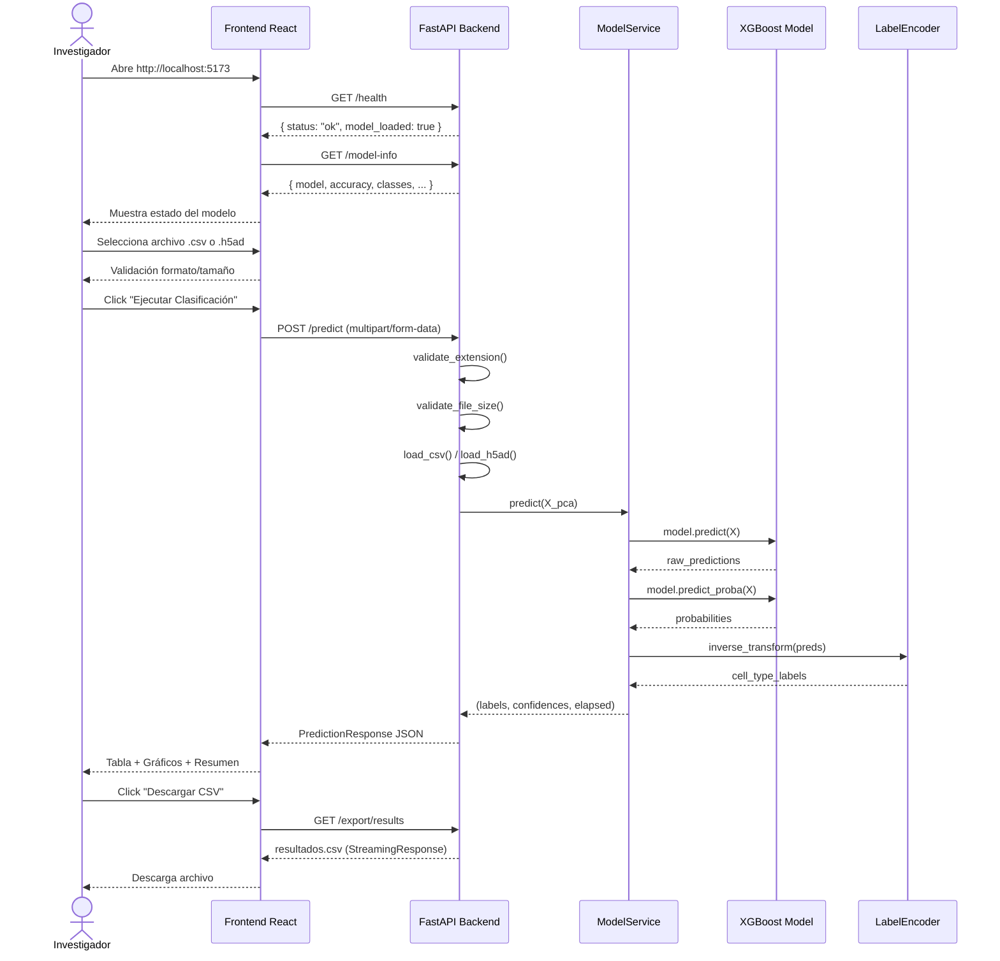

# Arquitectura del Sistema — Clasificador scRNA-seq

## Diagrama de flujo completo



## Capas del sistema

```
┌─────────────────────────────────────────────────────┐
│                  CAPA DE PRESENTACIÓN                │
│  React 18 + TypeScript + Vite + Tailwind CSS        │
│  Recharts (visualizaciones) · Lucide (iconos)        │
├─────────────────────────────────────────────────────┤
│                  CAPA DE COMUNICACIÓN                │
│  REST API · JSON · Axios · CORS                      │
├─────────────────────────────────────────────────────┤
│                  CAPA DE API                         │
│  FastAPI 0.111 · Pydantic v2 · Uvicorn               │
│  Endpoints: /health /model-info /predict /export/*   │
├─────────────────────────────────────────────────────┤
│                  CAPA DE SERVICIOS                   │
│  ModelService · FileValidator · ExportService        │
├─────────────────────────────────────────────────────┤
│                  CAPA DE MODELO ML                   │
│  XGBoost · scikit-learn LabelEncoder                 │
│  50 componentes PCA · 6 clases celulares             │
└─────────────────────────────────────────────────────┘
```

## Decisiones de diseño

| Decisión | Justificación |
|----------|--------------|
| FastAPI | Performance, tipado automático, Swagger nativo |
| Pydantic v2 | Validación robusta de schemas |
| Lifespan context | Carga del modelo una sola vez al inicio |
| Modo demo | Permite probar la UI sin el modelo real |
| Streaming CSV | Evita memory overflow en datasets grandes |
| PCA-only input | Reduce dimensionalidad: 2000 genes → 50 features |
| Paginación tabla | Soporta datasets de cientos de miles de células |
