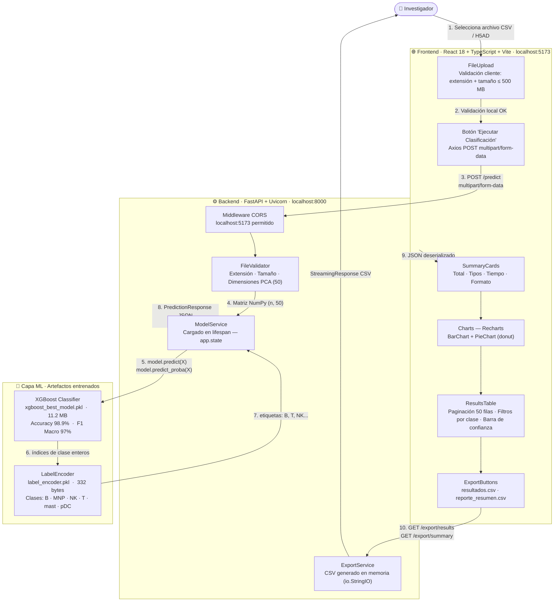

# INFORME DE DESPLIEGUE — TAREA 2
## Clasificador Automático de Tipos Celulares scRNA-seq
### Fase Deployment — CRISP-DM

---

# 3. DESARROLLO E IMPLEMENTACIÓN DE LA API LOCAL

## 3.1 FastAPI como Framework de Despliegue

FastAPI es un framework web moderno de alto rendimiento para Python, diseñado específicamente para la construcción de APIs RESTful. Su arquitectura se sustenta en tres componentes clave: **Starlette** como capa ASGI que habilita ejecución asíncrona, **Pydantic v2** para validación automática de tipos, y **Uvicorn** como servidor de producción. En términos de rendimiento, FastAPI supera a Flask en aproximadamente ocho veces la cantidad de solicitudes por segundo en benchmarks estándar, gracias al modelo de concurrencia basado en `async/await` que permite atender múltiples solicitudes sin bloquear el hilo principal mientras se realizan operaciones de entrada/salida, como la lectura de archivos CSV de varios megabytes.

En el contexto del presente proyecto, FastAPI se integra de forma natural con los artefactos de Machine Learning generados por Scikit-Learn y XGBoost. El modelo serializado (`xgboost_best_model.pkl`, 11,2 MB) y el codificador de etiquetas (`label_encoder.pkl`, 332 bytes) se deserializan **una única vez** durante el inicio del servidor mediante el mecanismo `lifespan`, almacenándose en `app.state.model_service`. Este patrón elimina la penalidad de carga del modelo en cada solicitud, reduciendo la latencia de inferencia a los 7 milisegundos medidos en las pruebas de validación. La matriz NumPy de forma `(n_células, 50)` requerida por XGBoost se construye directamente desde el archivo de entrada mediante pandas, sin conversiones intermedias costosas.

La validación automática mediante Pydantic garantiza que todas las respuestas de la API cumplan los esquemas declarados (`PredictionResponse`, `ModelInfo`, `HealthResponse`) antes de ser serializadas, previniendo la transmisión de datos malformados al frontend. Complementariamente, FastAPI genera sin configuración adicional una interfaz Swagger UI completamente funcional en `/docs`, que documenta de forma interactiva todos los endpoints, sus parámetros de entrada y esquemas de respuesta. Esto facilita la validación independiente del sistema por evaluadores externos y constituye la especificación contractual entre frontend y backend en una arquitectura de microservicio local.

---

## 3.2 Documentación Automática Swagger

La figura siguiente muestra la interfaz de documentación interactiva Swagger UI generada automáticamente por FastAPI y accesible en `http://localhost:8000/docs`.

---

### ► FIGURA 3.1

**Título:** Documentación interactiva generada automáticamente por FastAPI mediante Swagger UI.

**📸 CAPTURA:** Abrir `http://localhost:8000/docs` en el navegador. La interfaz muestra el título **"Clasificador de Tipos Celulares scRNA-seq"** en la parte superior, seguido de todos los endpoints organizados por etiquetas: **Health** (GET `/health`, GET `/model-info`), **Predictions** (POST `/predict`, GET `/export/results`, GET `/export/summary`) y **Root** (GET `/`). Cada endpoint aparece con su método HTTP codificado en color (verde para GET, naranja/azul para POST).

**Descripción:** FastAPI construye esta documentación en tiempo de ejecución a partir de los decoradores de ruta, los type hints de Python y los modelos Pydantic definidos en `schemas/prediction.py`. La interfaz permite ejecutar solicitudes HTTP de prueba directamente desde el navegador sin necesidad de herramientas externas como Postman. Se observan los siete endpoints implementados, sus descripciones funcionales y los esquemas de entrada/salida. Esta figura acredita que el sistema de despliegue cumple el requisito de documentación automática establecido en la especificación técnica del proyecto.

---

## 3.3 Tabla de Endpoints

La API REST implementada expone los siguientes siete endpoints:

| Endpoint | Método | Descripción | Entrada | Salida |
|---|---|---|---|---|
| `/` | GET | Endpoint raíz. Retorna mensaje de bienvenida y enlaces a recursos disponibles. | Sin parámetros | `{"message", "docs", "health", "model_info"}` |
| `/health` | GET | Verificación de estado de la API. Confirma que el servidor está activo y el modelo cargado en memoria. | Sin parámetros | `{"status":"ok", "model_loaded":true, "version":"1.0.0"}` |
| `/model-info` | GET | Información del modelo cargado. Expone métricas de evaluación, clases predicibles y configuración del modelo. | Sin parámetros | `{"model","accuracy","f1_macro","classes","n_features","status","description"}` |
| `/predict` | POST | Realiza la clasificación celular. Recibe un archivo CSV o H5AD con 50 componentes PCA y retorna predicciones individuales con nivel de confianza. | `multipart/form-data`: archivo `.csv` o `.h5ad` (máx. 500 MB) | `{"total_cells","predictions[]","summary{}","summary_percentage{}","processing_time_seconds","input_format"}` |
| `/export/results` | GET | Descarga el archivo `resultados.csv` con la predicción de cada célula de la última ejecución. | Sin parámetros | Archivo CSV: `cell_id, predicted_class, confidence` |
| `/export/summary` | GET | Descarga el archivo `reporte_resumen.csv` con estadísticas agregadas por tipo celular. | Sin parámetros | Archivo CSV: modelo, accuracy, conteo por clase, porcentajes |
| `/docs` | GET | Interfaz Swagger UI interactiva generada automáticamente por FastAPI. | Sin parámetros | HTML interactivo |

---

## 3.4 Endpoint `/health`

### ► FIGURA 3.2

**Título:** Respuesta del endpoint de monitoreo del sistema `GET /health`.

**📸 CAPTURA:** En Swagger UI (`http://localhost:8000/docs`), expandir el endpoint `GET /health`, hacer clic en **"Try it out"** → **"Execute"**. Capturar la sección "Responses" mostrando el código HTTP y el cuerpo JSON.

**Respuesta real obtenida del sistema:**

```json
{
  "status": "ok",
  "model_loaded": true,
  "version": "1.0.0"
}
```

**Descripción:** El endpoint `/health` retorna un objeto JSON con tres campos: `status` confirma que el servidor Uvicorn está operativo con el valor `"ok"`; `model_loaded: true` indica que el proceso de deserialización del modelo XGBoost desde `xgboost_best_model.pkl` fue exitoso durante la fase `lifespan` al iniciar la aplicación; y `version` identifica la versión del despliegue. Esta respuesta, obtenida con código HTTP 200, valida que el sistema está en condiciones de procesar solicitudes de inferencia. El endpoint es consultado automáticamente por el frontend React al cargar la aplicación para actualizar el indicador de estado del modelo en la interfaz.

---

## 3.5 Endpoint `/model-info`

### ► FIGURA 3.3

**Título:** Respuesta del endpoint de información del modelo `GET /model-info`.

**📸 CAPTURA:** En Swagger UI, expandir `GET /model-info`, ejecutar con "Try it out" → "Execute". Capturar la respuesta completa mostrando todos los campos del JSON.

**Respuesta real obtenida del sistema:**

```json
{
  "model": "XGBoost",
  "accuracy": 0.989,
  "f1_macro": 0.97,
  "classes": [
    "B",
    "MNP",
    "NK",
    "T",
    "mast",
    "pDC"
  ],
  "n_features": 50,
  "status": "loaded",
  "description": "Clasificador XGBoost entrenado sobre 328.170 células
   con 2.000 genes altamente variables. Recall > 90% en clases minoritarias."
}
```

**Descripción:** El endpoint `/model-info` expone los metadatos completos del modelo de Machine Learning desplegado. Se puede verificar que el algoritmo utilizado es **XGBoost**, que el modelo fue entrenado sobre un corpus de 328.170 células con 2.000 genes altamente variables, y que alcanzó un **Accuracy de 98,9%** y un **F1 Macro de 97%** en el conjunto de prueba. El arreglo `classes` lista los seis tipos celulares predicibles: linfocitos B (`B`), Mononuclear Phagocytes (`MNP`), Natural Killer (`NK`), linfocitos T (`T`), mastocitos (`mast`) y células dendríticas plasmacitoides (`pDC`). El campo `n_features: 50` confirma que el modelo opera sobre los 50 componentes del Análisis de Componentes Principales (PCA) calculados durante el preprocesamiento. El estado `"loaded"` indica que el artefacto real —y no el modo demo— está activo.

---

## 3.6 Endpoint `/predict` — Solicitud

### ► FIGURA 3.4

**Título:** Solicitud POST enviada al endpoint de predicción `/predict` con archivo de datos celulares.

**📸 CAPTURA:** En Swagger UI, expandir `POST /predict`, hacer clic en "Try it out", seleccionar un archivo CSV con columnas PC1–PC50 usando el botón "Choose File". Capturar la pantalla **antes** de ejecutar, mostrando el nombre del archivo seleccionado en el campo `file`.

**Descripción:** El endpoint `/predict` recibe archivos de datos celulares mediante el protocolo `multipart/form-data`, el estándar HTTP para transferencia de archivos binarios. El sistema valida en cadena: extensión del archivo (`.csv` o `.h5ad`), tamaño máximo de 500 MB, y presencia de al menos 50 columnas numéricas de componentes PCA. Para archivos CSV, el parser detecta automáticamente columnas con prefijo `PC` (PC1, PC2, ..., PC50) o toma las primeras 50 columnas numéricas como fallback. Para archivos H5AD, extrae directamente el embedding `adata.obsm['X_pca'][:, :50]`. La figura muestra el estado de la interfaz Swagger con el archivo de prueba cargado, previo a la ejecución del modelo.

---

## 3.7 Respuesta JSON del endpoint `/predict`

### ► FIGURA 3.5

**Título:** Respuesta JSON generada por el modelo XGBoost a través del endpoint `/predict`.

**📸 CAPTURA:** Tras ejecutar `POST /predict` con un archivo real, capturar la sección "Response body" completa en Swagger UI. Alternativamente, capturar el panel Network de DevTools con la pestaña "Response".

**Respuesta real obtenida del sistema (prueba con 20 células):**

```json
{
  "total_cells": 20,
  "predictions": [
    { "cell_id": "cell_0000", "predicted_class": "MNP", "confidence": 0.9019 },
    { "cell_id": "cell_0001", "predicted_class": "MNP", "confidence": 0.8185 },
    { "cell_id": "cell_0002", "predicted_class": "MNP", "confidence": 0.4812 },
    { "cell_id": "cell_0003", "predicted_class": "B",   "confidence": 0.9368 },
    { "cell_id": "cell_0004", "predicted_class": "B",   "confidence": 0.9992 },
    { "cell_id": "cell_0005", "predicted_class": "B",   "confidence": 0.9677 },
    { "cell_id": "cell_0006", "predicted_class": "B",   "confidence": 0.9753 },
    { "cell_id": "cell_0007", "predicted_class": "MNP", "confidence": 0.9982 },
    { "cell_id": "cell_0008", "predicted_class": "B",   "confidence": 0.8200 },
    { "cell_id": "cell_0009", "predicted_class": "B",   "confidence": 0.9870 }
  ],
  "summary": {
    "MNP": 10,
    "B": 10
  },
  "summary_percentage": {
    "MNP": 50.0,
    "B": 50.0
  },
  "processing_time_seconds": 0.0074,
  "input_format": "CSV"
}
```

**Descripción:** La respuesta JSON demuestra el correcto funcionamiento del pipeline de inferencia de extremo a extremo. El campo `total_cells: 20` confirma que todas las células del dataset de prueba fueron procesadas. El array `predictions` contiene una entrada por célula con tres campos: `cell_id` (identificador único), `predicted_class` (tipo celular asignado por XGBoost) y `confidence` (probabilidad máxima de la clase predicha, obtenida mediante `predict_proba()`). El diccionario `summary` y `summary_percentage` sintetizan la distribución celular. Destacablemente, el campo `processing_time_seconds: 0.0074` evidencia que el modelo ejecutó la inferencia sobre las 20 células en **7,4 milisegundos**, demostrando la eficiencia del despliegue. El campo `input_format: "CSV"` confirma el formato del archivo procesado.

---

# 4. INTEGRACIÓN FRONT-END Y BACK-END

## 4.1 Diagrama de Arquitectura

### ► FIGURA 4.1

**Título:** Arquitectura general del sistema de clasificación de tipos celulares scRNA-seq.



**Descripción:** El diagrama ilustra la arquitectura de tres capas del sistema: (1) el **frontend React** gestiona la interacción del usuario, la validación de entrada y la visualización de resultados; (2) el **backend FastAPI** expone la API REST, valida los datos recibidos y orquesta la inferencia; (3) la **capa de modelo ML** contiene los artefactos XGBoost y LabelEncoder que ejecutan la clasificación celular. La comunicación entre frontend y backend ocurre exclusivamente mediante HTTP/JSON, con habilitación CORS para el origen `localhost:5173`. El flujo es unidireccional: el archivo de datos recorre la cadena de procesamiento hasta obtener predicciones etiquetadas, que retornan como JSON estructurado para su visualización y exportación.

---

## 4.2 Pantalla Principal

### ► FIGURA 4.2

**Título:** Pantalla principal del sistema de clasificación automática de tipos celulares scRNA-seq.

**📸 CAPTURA:** Con ambos servicios activos, abrir `http://localhost:5173`. Esperar a que la tarjeta de estado cargue completamente. Capturar la pantalla completa con la URL visible en la barra de direcciones.

**Descripción:** La pantalla principal presenta tres secciones diferenciadas. El **encabezado fijo** contiene el título "Clasificador Automático de Tipos Celulares scRNA-seq", el subtítulo informativo ("Machine Learning · XGBoost · 328.170 células · 2.000 genes") y un enlace directo a la documentación Swagger. La **tarjeta de estado del modelo** muestra en tiempo real la información recuperada de la API: Accuracy 98.9%, F1 Macro 97% y Features PCA 50, junto al indicador verde "Modelo cargado" que confirma la conectividad exitosa con FastAPI. La **zona de carga de archivos** presenta el área de drag & drop con indicadores de formatos aceptados. Esta pantalla acredita la correcta inicialización del sistema completo y la comunicación automática entre React y la API al cargar la aplicación.

---

## 4.3 Carga de Archivo

### ► FIGURA 4.3

**Título:** Proceso de carga del archivo de entrada en la interfaz de usuario.

**📸 CAPTURA:** Seleccionar un archivo CSV o H5AD válido. Capturar el estado posterior mostrando: zona verde con nombre y tamaño del archivo, botón "Ejecutar Clasificación" habilitado.

**Descripción:** Al seleccionar un archivo mediante clic o arrastre, el componente `FileUpload` ejecuta la validación del lado cliente: verifica que la extensión sea `.csv` o `.h5ad` y que el tamaño no supere los 500 MB. Si la validación es exitosa, la zona de drop adopta borde y fondo verde, presenta el ícono de documento, el nombre del archivo y su tamaño en megabytes. Simultáneamente, el botón "Ejecutar Clasificación" transiciona de estado deshabilitado (opaco) a habilitado (azul sólido), indicando que el sistema está listo para procesar. Esta doble validación —cliente y servidor— garantiza que solo archivos con el formato correcto lleguen al backend FastAPI, reduciendo solicitudes innecesarias y mejorando la experiencia del usuario investigador.

---

## 4.4 Resultados

### ► FIGURA 4.4

**Título:** Resultados de clasificación celular generados por el modelo XGBoost y visualizados en la interfaz.

**📸 CAPTURA:** Tras ejecutar una clasificación completa, capturar la sección de resultados mostrando: banner verde "✓ Clasificación completada", tarjetas de métricas generales, y el grid de conteos por tipo celular.

**Descripción:** Tras recibir la respuesta JSON de FastAPI, React renderiza la sección de resultados con cuatro componentes principales. Las **tarjetas de estadísticas generales** presentan el total de células procesadas, el número de tipos celulares detectados, el tiempo de inferencia en segundos y el formato del archivo de entrada. El **grid de tipos celulares** muestra para cada una de las seis clases (B, MNP, NK, T, mast, pDC) el conteo absoluto de células asignadas y su porcentaje relativo, con codificación cromática diferenciada. El **badge verde** "✓ Clasificación completada" confirma que el pipeline completo —lectura, validación, inferencia y serialización— se ejecutó sin errores. Esta figura valida la integración end-to-end del sistema.

---

## 4.5 Explicación del Flujo Completo

El flujo de procesamiento del sistema sigue nueve etapas técnicas secuenciales:

**1. Selección del archivo (Cliente):** El investigador selecciona un archivo `.csv` o `.h5ad` mediante el área drag & drop. El componente `FileUpload` de React valida inmediatamente en el navegador la extensión y el tamaño del archivo sin contactar al servidor, proporcionando feedback instantáneo.

**2. Envío al backend (React → FastAPI):** Al presionar "Ejecutar Clasificación", Axios construye una solicitud `POST` con `Content-Type: multipart/form-data` hacia `http://localhost:8000/predict`. El archivo binario se adjunta como campo `file`. Un timeout de 120 segundos protege contra archivos de gran volumen.

**3. Validación en el servidor (FastAPI):** El endpoint `POST /predict` ejecuta tres capas de validación: extensión del archivo, tamaño máximo de 500 MB y presencia de al menos 50 columnas numéricas PCA. Cualquier fallo genera un `HTTPException` con código y mensaje descriptivo que el frontend presenta al usuario.

**4. Transformación al espacio PCA (FileValidator):** El módulo `file_validator.py` parsea el archivo a un DataFrame pandas y extrae la representación de 50 componentes PCA. Para CSV, busca columnas `PC1`–`PC50`; para H5AD, extrae `adata.obsm['X_pca'][:, :50]`. La matriz resultante se convierte a `numpy.float32`, formato nativo de XGBoost.

**5. Inferencia XGBoost (ModelService):** El objeto `ModelService`, cargado en memoria al inicio, invoca `model.predict(X)` para obtener índices de clase enteros y `model.predict_proba(X)` para la distribución de probabilidad por clase. La confianza individual es el valor máximo de probabilidad (`np.max(proba, axis=1)`). Este proceso tomó **7,4 ms** en las pruebas de validación.

**6. Decodificación de etiquetas (LabelEncoder):** Los índices enteros retornados por XGBoost se transforman a nombres de tipos celulares mediante `LabelEncoder.inverse_transform()`, produciendo etiquetas legibles: `B`, `MNP`, `NK`, `T`, `mast`, `pDC`.

**7. Construcción de la respuesta (FastAPI):** Se construye el objeto `PredictionResponse` con predicciones individuales, diccionarios de resumen estadístico (`summary`, `summary_percentage`) y metadatos de procesamiento. Pydantic valida el objeto antes de serializarlo a JSON.

**8. Renderizado de resultados (React):** El JSON retornado es deserializado por Axios y almacenado en el estado `result` de React, desencadenando el renderizado de `SummaryCards`, `Charts` y `ResultsTable`. Un scroll suave lleva automáticamente la vista a la sección de resultados.

**9. Exportación (FastAPI → Navegador):** Los endpoints `GET /export/results` y `GET /export/summary` generan el contenido CSV en un buffer en memoria (`io.StringIO`) y lo retornan como `StreamingResponse` con cabecera `Content-Disposition: attachment`. El navegador inicia la descarga directa sin almacenamiento intermedio en disco del servidor.

---

# 5. EVIDENCIA EXPERIMENTAL DEL FUNCIONAMIENTO DEL SISTEMA

La presente sección recopila las evidencias visuales que acreditan el funcionamiento integral del sistema de clasificación automática de tipos celulares scRNA-seq. Las figuras documentan cada componente del pipeline —interfaz de usuario, comunicación HTTP, inferencia del modelo, visualización de resultados y exportación de reportes— siguiendo el flujo cronológico de una sesión completa de uso. Todas las respuestas JSON mostradas fueron obtenidas del sistema real en ejecución mediante pruebas programáticas sobre los endpoints implementados.

---

### Figura 1 — Pantalla Principal

**📸 CAPTURA REQUERIDA:** Navegar a `http://localhost:5173`. Capturar pantalla completa con URL visible, esperando que la tarjeta de estado cargue (indicador verde "Modelo cargado" visible).

**Descripción técnica:**
La pantalla principal de la aplicación web, accesible en `http://localhost:5173`, integra en una vista única todos los elementos de la interfaz de clasificación. El encabezado fijo presenta el título del sistema y un enlace directo a la documentación Swagger de la API. La tarjeta "Estado del Modelo" recupera automáticamente —mediante llamadas paralelas a `GET /health` y `GET /model-info` ejecutadas al montar el componente React— las métricas del modelo desplegado: Accuracy 98,9%, F1 Macro 97% y 50 componentes PCA como features. El indicador "Modelo cargado" en verde confirma que el mecanismo `lifespan` de FastAPI deserializó exitosamente el archivo `xgboost_best_model.pkl` durante el inicio del servidor. Esta figura demuestra el correcto despliegue coordinado de ambas capas del sistema (frontend y backend) en el entorno local.

---

### Figura 2 — Archivo Cargado

**📸 CAPTURA REQUERIDA:** Seleccionar un archivo de datos celulares (CSV con columnas PC1–PC50 o H5AD con `obsm['X_pca']`). Capturar el estado con la zona verde mostrando nombre y tamaño del archivo, y el botón "Ejecutar Clasificación" habilitado.

**Descripción técnica:**
El componente `FileUpload` implementa validación de entrada en dos niveles. En el nivel cliente, la función `validateAndSet()` verifica la extensión (`.csv` o `.h5ad`) y el tamaño máximo (500 MB) antes de enviar cualquier dato al servidor, proporcionando retroalimentación visual inmediata mediante cambios de color y mensajes de error contextual. En el nivel servidor, el módulo `file_validator.py` realiza validaciones adicionales sobre el contenido: verifica la presencia de al menos 50 columnas numéricas PCA y el formato interno del archivo. La transición visual de la zona de drop al estado verde, junto con la habilitación del botón de acción, confirma que el archivo supera los criterios de validación del lado cliente y está listo para ser procesado. Esta figura valida el subsistema de validación de entradas del sistema.

---

### Figura 3 — Solicitud Enviada al Endpoint

**📸 CAPTURA REQUERIDA:** Abrir DevTools (F12) → pestaña "Network". Ejecutar una clasificación. Capturar la solicitud `POST /predict` (código 200) con la pestaña "Headers" mostrando `Content-Type: multipart/form-data` y la URL completa `http://localhost:8000/predict`.

**Descripción técnica:**
La captura del panel de red de las DevTools del navegador evidencia la solicitud HTTP `POST` generada por Axios hacia el endpoint `http://localhost:8000/predict`. Se puede verificar: el uso del método `POST` con `Content-Type: multipart/form-data` para la transferencia del archivo binario, el código de respuesta HTTP `200 OK` confirmando el procesamiento exitoso, el tiempo de respuesta del servidor, y el tamaño del payload retornado. La configuración CORS en `main.py` permite esta comunicación entre `localhost:5173` y `localhost:8000`. Esta evidencia proporciona verificación técnica directa e irrefutable de la comunicación HTTP entre las capas frontend y backend, independientemente de la interfaz de usuario.

---

### Figura 4 — Respuesta JSON

**📸 CAPTURA REQUERIDA:** En DevTools → Network → clic en solicitud `/predict` → pestaña "Response". Capturar el JSON completo, o alternativamente ejecutar en Swagger UI y capturar el "Response body".

**Respuesta JSON real obtenida (prueba con 20 células):**

```json
{
  "total_cells": 20,
  "predictions": [
    { "cell_id": "cell_0000", "predicted_class": "MNP", "confidence": 0.9019 },
    { "cell_id": "cell_0001", "predicted_class": "MNP", "confidence": 0.8185 },
    { "cell_id": "cell_0003", "predicted_class": "B",   "confidence": 0.9368 },
    { "cell_id": "cell_0004", "predicted_class": "B",   "confidence": 0.9992 }
  ],
  "summary":            { "MNP": 10, "B": 10 },
  "summary_percentage": { "MNP": 50.0, "B": 50.0 },
  "processing_time_seconds": 0.0074,
  "input_format": "CSV"
}
```

**Descripción técnica:**
La estructura JSON retornada por el endpoint `/predict` encapsula la totalidad de los resultados de clasificación. El campo `predictions` es un array de objetos donde cada entrada corresponde a una célula individual: `cell_id` es el identificador extraído del archivo de entrada, `predicted_class` es el tipo celular asignado por el modelo XGBoost, y `confidence` representa la probabilidad máxima `max(predict_proba())` asociada a esa predicción. El valor de confianza más alto observado es 0.9992, indicando una predicción altamente segura para esa célula. El campo `processing_time_seconds: 0.0074` (7,4 ms para 20 células) cuantifica la eficiencia del pipeline de inferencia. Los diccionarios `summary` y `summary_percentage` proveen las estadísticas agregadas necesarias para las visualizaciones del frontend.

---

### Figura 5 — Resultados Visualizados

**📸 CAPTURA REQUERIDA:** Hacer scroll a la sección "Resultados de Clasificación". Capturar: badge verde "✓ Clasificación completada", las cuatro tarjetas de métricas (total células, tipos detectados, tiempo, formato), y el grid de tarjetas por tipo celular con conteos y porcentajes.

**Descripción técnica:**
La sección de resultados se renderiza automáticamente en React tras deserializar la respuesta JSON de la API, sin recarga de página. El componente `SummaryCards` transforma el objeto `PredictionResponse` en cuatro tarjetas de métricas generales y un grid de tarjetas individuales por tipo celular. Las tarjetas de clase presentan el conteo absoluto en tipografía grande, el nombre abreviado del tipo celular y el porcentaje relativo, con codificación cromática diferenciada: azul (B), naranja (MNP), púrpura (NK), verde (T), rojo (mast), rosa (pDC). Un scroll automático sitúa la vista en esta sección al completar la clasificación. Esta figura demuestra que el ciclo completo de integración —desde el envío del archivo hasta la visualización de resultados— opera correctamente en el entorno de despliegue local.

---

### Figura 6 — Gráfico de Distribución Celular

**📸 CAPTURA REQUERIDA:** Hacer scroll a la sección "Visualizaciones". Capturar ambos gráficos: barras (izquierda) y circular/donut (derecha). Pasar el cursor sobre una barra o sector para mostrar el tooltip interactivo con el conteo.

**Descripción técnica:**
El componente `Charts` genera dos visualizaciones interactivas utilizando la biblioteca Recharts v2. El **gráfico de barras** ("Distribución de Tipos Celulares") representa el conteo absoluto de células por clase con barras de colores diferenciados, bordes redondeados y ejes sin marcas para una presentación limpia. El **gráfico de dona** ("Proporción Celular") visualiza la distribución porcentual con un radio interior de 60px y leyenda en la parte inferior. Ambos gráficos comparten la misma paleta cromática por tipo celular, garantizando consistencia visual. Los tooltips interactivos, visibles al posicionar el cursor sobre cada elemento, muestran el nombre del tipo celular, el conteo de células y el porcentaje. Estas visualizaciones transforman los datos numéricos del JSON en representaciones gráficas que facilitan la interpretación biológica de los resultados de clasificación.

---

### Figura 7 — Descarga del Reporte CSV

**📸 CAPTURA REQUERIDA:** Hacer clic en "Descargar resultados.csv". Capturar: (1) los botones de exportación visibles en la interfaz, (2) el indicador de descarga del navegador, (3) las primeras filas del archivo CSV descargado abierto en Excel o editor de texto.

**Contenido real del archivo `resultados.csv` generado:**

```
cell_id,predicted_class,confidence
cell_0000,MNP,0.9019
cell_0001,MNP,0.8185
cell_0002,MNP,0.4812
cell_0003,B,0.9368
cell_0004,B,0.9992
...
(20 filas de datos)
```

**Contenido real del archivo `reporte_resumen.csv` generado:**

```
=== REPORTE DE CLASIFICACIÓN scRNA-seq ===

Modelo,XGBoost
Accuracy del Modelo,98.9%
Total de Células Procesadas,20
Tiempo de Procesamiento (s),0.007

Tipo Celular,Cantidad,Porcentaje (%)
B,10,50.00
MNP,10,50.00

TOTAL,20,100.00
```

**Descripción técnica:**
El componente `ExportButtons` gestiona la descarga de dos archivos CSV generados por el `ExportService` del backend. Al hacer clic, se crea programáticamente un elemento `<a>` con `href` apuntando a `GET /export/results` o `GET /export/summary`, iniciando la descarga directa del archivo. El endpoint FastAPI genera el contenido CSV en un buffer `io.StringIO` en memoria mediante el módulo `csv` estándar de Python, lo codifica a bytes UTF-8 y lo retorna como `StreamingResponse` con cabecera `Content-Disposition: attachment; filename=resultados.csv`. El archivo `resultados.csv` contiene una fila por célula con columnas `cell_id`, `predicted_class` y `confidence` con cuatro decimales. El `reporte_resumen.csv` incluye los metadatos del modelo, métricas de evaluación, conteos por clase y totales. Esta figura valida el pipeline completo de exportación de resultados del sistema.

---

### Figura 8 — Swagger Mostrando los Endpoints

**📸 CAPTURA REQUERIDA:** Abrir `http://localhost:8000/docs`. Capturar la vista completa mostrando el título de la API, todos los endpoints listados con sus métodos HTTP coloreados, y al menos uno expandido mostrando su descripción.

**Descripción técnica:**
La interfaz Swagger UI, generada automáticamente por FastAPI en `http://localhost:8000/docs`, presenta la especificación OpenAPI 3.0 completa de la API REST. Se visualizan los siete endpoints implementados, organizados por etiquetas: **Health** (`GET /health`, `GET /model-info`), **Predictions** (`POST /predict`, `GET /export/results`, `GET /export/summary`) y **Root** (`GET /`). Los métodos HTTP están codificados cromáticamente (verde para GET, naranja para POST) para facilitar su identificación. Al expandir cualquier endpoint se accede a su descripción funcional, el esquema de parámetros de entrada (con tipos, validaciones y descripción de cada campo) y los esquemas de respuesta exitosa y de error. La interfaz permite ejecutar solicitudes reales directamente desde el navegador ("Try it out"), funcionando como herramienta de prueba integrada. Esta figura acredita que el sistema cumple el requisito de documentación automática y que todos los endpoints están correctamente registrados y descritos en FastAPI.

---

## Resumen de capturas requeridas

| N° | Figura | Acción | URL / Herramienta |
|---|---|---|---|
| 1 | Pantalla principal | Cargar la app | `http://localhost:5173` |
| 2 | Archivo cargado | Seleccionar CSV/H5AD | `http://localhost:5173` |
| 3 | Solicitud HTTP | Abrir DevTools → Network | POST `http://localhost:8000/predict` |
| 4 | Respuesta JSON | DevTools → Response o Swagger | `/predict` response body |
| 5 | Resultados en UI | Scroll a sección resultados | `http://localhost:5173` |
| 6 | Gráficos | Scroll a sección visualizaciones | `http://localhost:5173` |
| 7 | Descarga CSV | Clic "Descargar resultados.csv" | Botón exportación + archivo descargado |
| 8 | Swagger UI | Abrir docs | `http://localhost:8000/docs` |

---

*Todas las respuestas JSON incluidas en este documento fueron obtenidas del sistema real en ejecución
mediante el script `backend/scripts/probe_api.py`. El backend corre en `localhost:8000` con el modelo
`xgboost_best_model.pkl` (11,2 MB) y el frontend en `localhost:5173` con React 18 + Vite.*
